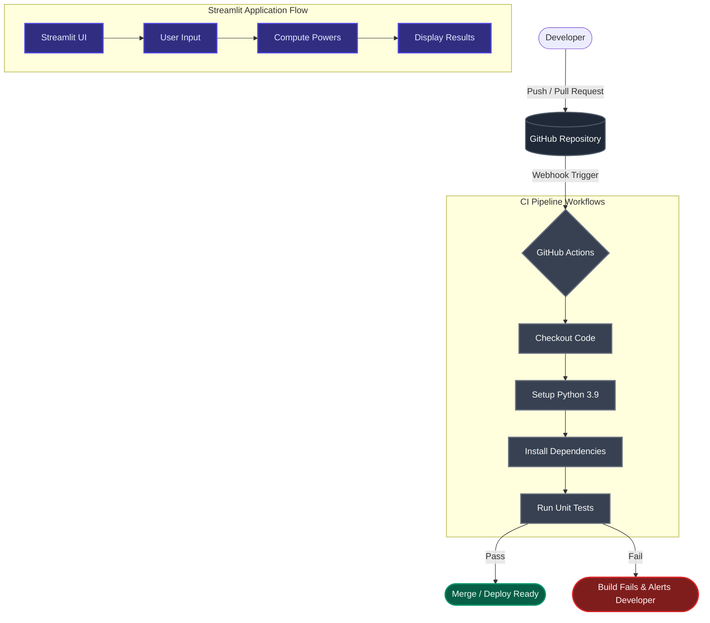

# CI-Pipeline: Power Calculator


## 📌 Overview
This project demonstrates an end-to-end implementation of Continuous Integration (CI) using GitHub Actions. It features a simple yet effective **Power Calculator** built with [Streamlit](https://streamlit.io/), which calculates the square, cube, and fifth power of a given integer. The project includes a robust automated testing suite using `pytest` to ensure code reliability.

## 🏗 Architecture & CI Flow

The following diagram illustrates the Continuous Integration workflow and application architecture:



## ✨ Features
- **Interactive UI:** A clean, user-friendly web interface built with Streamlit.
- **Mathematical Computations:** Instantly calculates $x^2$, $x^3$, and $x^5$.
- **Automated Testing:** Unit tests written with `pytest` to validate core functions and handle invalid inputs.
- **Continuous Integration:** Automated GitHub Actions workflow that runs tests on every push and pull request to the `main` branch.

## 🚀 Getting Started

### Prerequisites
- Python 3.9 or higher
- `pip` package manager

### Installation

1. **Clone the repository:**
   ```bash
   git clone https://github.com/Rupeshbhardwaj002/CI-Pipeline.git
   cd CI-Pipeline
   ```

2. **Install dependencies:**
   ```bash
   pip install pytest streamlit
   ```

### Running the Application
To start the Streamlit application locally, run:
```bash
streamlit run app.py
```
The application will open in your default web browser at `http://localhost:8501`.

### Running Tests
To execute the test suite, simply run:
```bash
pytest _test.py
```

## 📂 Project Structure
```text
CI-Pipeline/
├── .github/workflows/
│   └── ci.yaml       # GitHub Actions CI pipeline configuration
├── app.py            # Main Streamlit application script
├── _test.py          # Unit tests using pytest
├── .gitignore        # Git ignore rules
└── LICENSE           # MIT License
```

## 🤝 Contributing
Contributions, issues, and feature requests are welcome! Feel free to check the [issues page](https://github.com/Rupeshbhardwaj002/CI-Pipeline/issues).

1. Fork the Project
2. Create your Feature Branch (`git checkout -b feature/AmazingFeature`)
3. Commit your Changes (`git commit -m 'Add some AmazingFeature'`)
4. Push to the Branch (`git push origin feature/AmazingFeature`)
5. Open a Pull Request

## 📝 License
Distributed under the MIT License. See `LICENSE` for more information.
